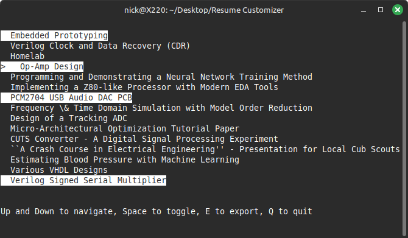

# Ncurses Resume Project Selector

A simple TUI to rapidly select which projects you want to include in your LaTeX resume.

<p align="center">
  
</p>

Takes in a JSON populated with your projects, and generates a `.tex` file with the projects you selected, which can be inserted into your resume like so:

```
\section*{Projects}
\input{projects.tex}
```

## Dependencies
- [Ncurses](https://invisible-island.net/ncurses/)
- [Jansson](https://github.com/akheron/jansson)
